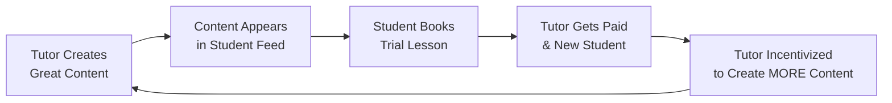

### **1. PROJECT_BRIEF.md**

```markdown
# Tutorhouse - Project Brief

## 🎯 One-Liner
Tutorhouse is the "TikTok for Tutor Discovery," transforming how students find the perfect tutor through engaging vertical video demos and live sessions.

## 🧠 The Problem
Finding a great tutor online is broken. Static text profiles and reviews fail to answer the most critical question: *"Is this tutor's teaching style right for me?"* The process is slow, impersonal, and lacks the trust needed to book a costly session.

## 💡 Our Solution
A shoppertainment-powered mobile app where tutors showcase their skills through **short intro videos** and **interactive live demo sessions**. Students discover tutors by swiping through a engaging, full-screen feed, building trust *before* they book.

## 🎪 The "Shoppertainment" Magic
- **For Students:** A addictive, TikTok-style feed to discover tutors. Watch a 60-second video or drop into a live demo, then book instantly.
- **For Tutors:** A content platform to build their personal brand. Go live to attract new students, build a video portfolio, and stop competing on price alone.

## 🚀 Our Advantage
We are not a startup from zero. We have an existing tutoring service with **58+ pre-vetted tutors** and a proven booking operation. We are productizing our acquisition funnel.

## 📱 Tech Stack
- **Frontend:** Flutter (iOS & Android)
- **Backend & DB:** Supabase (Auth, Postgres, Realtime, Storage)
- **Live Video:** Agora.io
- **Payments:** Stripe

## 📈 Key Metrics
- % of Demo Viewers → Bookings (Conversion)
- Avg. Time on App (Engagement)
- Tutor Content Creation Rate (Supply Side Health)
```

---

### **2. GENIUS_PRD.md (Detailed Product Requirements Document)**

# **Tutorhouse Shoppertainment App - Genius PRD**
**Version:** 2.0
**Status:** Draft
**Author:** AI Architect & Founder
**Last Updated:** Today

---

## 1. Product Vision & Strategy

### 1.1. Vision Statement
To become the default platform for authentic tutor discovery, making finding the right tutor as engaging, transparent, and effective as scrolling through your favorite social feed.

### 1.2. Product Philosophy
- **Content-First:** Video is the core unit of trust. A tutor's content is their best salesperson.
- **Supply-Obsessed:** The entire experience must be incredible for tutors to create content. No tutors, no content. No content, no students.
- **Atomic Habits:** The user journey should be a series of small, rewarding actions (swipe, watch, react, book) rather than a single, high-friction decision.

### 1.3. Business Model
- **Commission:** Take a 10-15% platform fee on all bookings originated through the app.
- **Premium Features (Future):** Tutor subscriptions for advanced analytics, promoted placements, and premium profile features.

## 2. Target Users & Personas

### 2.1. The Student (Primary User)
- **Name:** "Studious Sam"
- **Demographic:** 16-18 years old, A-Level / GCSE student.
- **Goals:** Find a tutor who explains things in a way they understand, quickly and without hassle.
- **Frustrations:** Boring profiles, unreliable tutors, expensive trial lessons.
- **Behavior:** Lives on TikTok/Instagram. Short attention span, high expectations for UX.

### 2.2. The Parent (Paying Customer)
- **Name:** "Practical Penny"
- **Demographic:** Parent of Sam, 40-55 years old.
- **Goals:** Find a credible, effective tutor without wasting money on bad trials.
- **Frustrations:** Lack of transparency, difficult to judge teaching quality from a bio.
- **Behavior:** Does the research, holds the purse strings. Needs to see proof.

### 2.3. The Tutor (The Product & Customer)
- **Name:** "Charismatic Chris"
- **Demographic:** University student or qualified teacher, 20-35 years old.
- **Goals:** Get a steady stream of new, well-paying students with less admin hassle.
- **Frustrations:** Competing on price on other platforms, difficult to stand out, unreliable students.
- **Behavior:** Willing to create content if it leads to more bookings. Wants to build a personal brand.

## 3. Core User Journeys & Flows

### 3.1. Journey A: Student Discovers & Books a Tutor
1.  **Onboard:** Quick sign-up. Select subjects of interest.
2.  **Discover:** Lands on the vertical, full-screen video feed.
    - **Swipe Up:** Sees a tutor's polished intro video. Sees their rating, subjects, price.
    - **Swipe Down:** Sees a tutor hosting a live demo session on a math problem. 20 others are watching and asking questions in the chat.
3.  **Engage:** Taps "Book Trial" on a video they like.
4.  **Book:** Selects an available time slot from the tutor's calendar. Pays seamlessly with saved card details.
5.  **Attend:** Receives a Zoom link. Attends the lesson.

### 3.2. Journey B: Tutor Onboards & Generates Leads
1.  **Apply:** Passes our vetting process (off-platform).
2.  **Onboard:** Downloads app, verifies profile.
3.  **Create:** Records a 60-second intro video directly in the app. "Hi, I'm Chris! I make physics fun. Here's how..."
4.  **Schedule:** Uses the app to schedule a Live Demo Session for next Wednesday at 5 PM on " GCSE Organic Chemistry."
5.  **Go Live:** On Wednesday, gets a notification. Presses "Go Live," and is instantly broadcasting to students in the app. Answers questions in real-time.
6.  **Convert:** Gets a notification: "3 students booked a trial from your live session!"

## 4. Technical Architecture & Data Model (Genius Level)

### 4.1. Supabase Schema Deep Dive
```sql
-- The CORE content table. The 'feed' is a view of this.
CREATE TABLE tutor_videos (
  id UUID PRIMARY KEY DEFAULT gen_random_uuid(),
  tutor_id UUID REFERENCES tutor_profiles(id) ON DELETE CASCADE,
  video_url TEXT NOT NULL, -- Stored in Supabase Storage
  video_type TEXT NOT NULL DEFAULT 'intro' CHECK (video_type IN ('intro', 'lesson_clip', 'topic_explainer')),
  is_published BOOLEAN DEFAULT FALSE, -- Content moderation gate
  is_main_intro BOOLEAN DEFAULT FALSE, -- The ONE video featured in discovery
  -- ... other fields ...
);

-- The engagement engine.
CREATE TABLE live_sessions (
  id UUID PRIMARY KEY DEFAULT gen_random_uuid(),
  tutor_id UUID REFERENCES tutor_profiles(id) ON DELETE CASCADE,
  status TEXT DEFAULT 'scheduled' CHECK (status IN ('scheduled', 'live', 'ended', 'cancelled')),
  scheduled_start_time TIMESTAMPTZ NOT NULL, -- For promotion
  actual_start_time TIMESTAMPTZ, -- For analytics
  agora_channel_name TEXT, -- Dynamically created on session start
  viewer_count INTEGER DEFAULT 0, -- Realtime updated via Supabase Realtime
  -- ... other fields ...
);
```

### 4.2. The "Feed" Algorithm (V1)
The main feed is a curated SQL query, not a complex algorithm.
```sql
SELECT *
FROM tutor_videos
WHERE is_published = true
AND (
  (video_type = 'intro' AND is_main_intro = true) -- Their best intro
  OR
  (id IN ( -- A video from a tutor who is currently LIVE
    SELECT tutor_id FROM live_sessions WHERE status = 'live'
  ))
)
ORDER BY 
  CASE WHEN [tutor is live] THEN 0 ELSE 1 END, -- Boost live tutors to top
  created_at DESC -- Then show newest first
```
**Evolution:** Phase 2 will incorporate user engagement signals (watch time, bookings) for personalization.

## 5. Feature Prioritization (MoSCoW Method)

### **MUST HAVE (MVP Launch)**
- **Vertical Video Feed:** Swipeable feed of tutor intro videos (`tutor_videos`).
- **Tutor Profiles:** With video, subjects, rating, bio.
- **1-Click Booking:** From video to booking modal with Stripe integration.
- **Basic Live Streams:** Agora integration for live demo sessions with real-time chat.
- **Tutor Onboarding:** In-app video recording & upload flow.

### **SHOULD HAVE (Viability)**
- **Schedule Live Sessions:** Tutors can schedule ahead of time for promotion.
- **Notifications:** "Your tutor is live!", "Session reminder."
- **Basic Search/Filter:** By subject, rating, price.

### **COULD HAVE (Differentiation)**
- **Video Portfolio:** Tutors can upload multiple videos to their profile.
- **Session Replays:** Watch recorded live sessions.
- **Advanced Feed Sorting:** By rating, relevance.

### **WON'T HAVE (Phase 2+)**
- In-app whiteboarding (use Zoom).
- Complex AI matching (start with curated feed).
- Group sessions (focus on 1-to-1 trials).

## 6. Monetization & GTM Strategy

### 6.1. Launch Strategy
- **Supply First:** Manually onboard all 58 existing tutors. Help them create stellar intro videos.
- **Land & Expand:** Launch app to a waitlist of existing students and parents for a soft launch.
- **Content Flywheel:** Use the initial content to attract new tutors and students.

### 6.2. Marketing Loop


## 7. Success Metrics & Analytics

| Metric | Target (MVP) | How We Measure |
| :--- | :--- | :--- |
| **Booking Conversion Rate** | >5% | # of bookings / # of unique video viewers |
| **Avg. Session Watch Time** | >45 seconds | Supabase Analytics |
| **Tutor Content Creation** | >70% of tutors | % with `is_main_intro = true` |
| **Weekly Active Tutors** | 15 | Tutors going live or getting a booking |
| **Customer Acquisition Cost** | < £20 | Ad spend / new paying students |

## 8. Appendix

### 8.1. Risks & Mitigations
- **Risk:** Low tutor content creation.
  - **Mitigation:** Manual onboarding support. Run a "best video" competition with cash prize.
- **Risk:** Low student engagement with live features.
  - **Mitigation:** Promote scheduled sessions heavily in-app. Send targeted notifications.

### 8.2. Open Questions
- What is the optimal length for an intro video? (A/B test: 45s vs 60s vs 75s)
- What is the best time of day for live demo sessions?
```

---

This PRD is a complete strategic and tactical guide. It provides the **vision** for investors, the **clarity** for your team, and the **specificity** for AI-assisted development with Cursor. Use it as your north star.